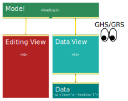

# CoreMedia General RichText Support

The General RichText Support (“GRS”) ensures that any valid CoreMedia RichText,
especially attributes, may be loaded into CKEditor 5. It does not provide any
editing features, but only registers elements, attributes and attribute-values,
which are not yet supported by corresponding editing and/or data-processing
features.

GRS is based on CKEditor 5's [General HTML Support (“GHS”)][GHS]. GRS shares the
same state as GHS, which is, as of now, an experimental state.

**Not part of CoreMedia Essentials:** This plugin is not part of the
_CoreMedia Essentials_, as it depends on your use-case, if you prefer running
CKEditor 5 in CoreMedia CMS with or without it.

## Do I need to install GRS?

Most likely: Yes.

If all your RichText data are created via CKEditor 5 within CoreMedia CMS:
most likely not. You should consider installing GRS, if you answer one of the
following question with _"yes"_:

* **Do you use CoreMedia CMS from before introducing CKEditor 5?**

    This of course especially applies to the data created from previous
    CMS versions, as those, still using CKEditor 4.

* **Do you create RichText with different CMS clients than CKEditor 5?**

    This applies to anything, from CoreMedia Unified API, XLIFF import,
    import from external sources (Content Hub), …

If not installing GRS, any RichText, which is loaded and edited within
CKEditor 5 will get all elements and attributes removed, which cannot be created
by the installed CKEditor 5 editing features. This may be a desired behavior,
though.

## Source Editing

The CKEditor Team recommends enabling the Source Editing feature if using GHS.
As GHS is the base technology for GRS, the same recommendation applies here.

**Special Note on Content Links and Content Blob Links (Images):** Links are
represented in a way, so that CoreMedia Studio understands them. Thus, a link
to a content with ID `2` is represented as `content/2`. Similar to that, Content
Blob references are expressed as: `content/2#properties.data`.

Users may be more used to the more verbose Unified API (UAPI) format. For the
examples above this would be:

* `coremedia:///cap/content/2`
* `coremedia:///cap/blob/content/2#data`

As convenience in Source Editing, both formats are understood. Note though, that
when closing Source Editing, the links will be transformed to the CoreMedia
Studio format. Thus, when opening Source Editing the next time, you will see
`content/2` again, for example.

## Pitfall: Customizing Default Data-Processing

**Short:** When you adapt data-processing for new elements and/or attributes
to be represented in CoreMedia RichText 1.0, you most likely also have to
extend the configuration of General HTML Support, thus, introduce a
`htmlSupport` configuration section.

**Architecture:** Prior to describing an important pitfall, which is relevant
as soon, as you customize data-processing like mapping an element unknown to
CoreMedia RichText 1.0 to a known element with some designated class attribute
value (such as `<mark>` to `<span class="mark">`), let's rephrase the
general architecture overview depicted in CKEditor 5 documentation on the
[Editing engine][]:

There is a subtle difference between the data retrieved via `editor.getData()`
and the data transformed to CKEditor model and later to CKEditor view: While
`editor.getData()` will provide CoreMedia RichText 1.0, the internal data
layer in CKEditor (as used for CoreMedia RichText 1.0 Editing) is represented
as HTML (which again is different from the HTML in view).

!

**Example:**

* **Data:** By contract, a heading level 1 is represented in CoreMedia RichText
    1.0 as `<p class="p--heading-1">`.

* **Data View:** The _data view_ when it comes to CoreMedia RichText 1.0 support
    is HTML. Thus, data-processing will transform `<p class="p--heading-1">` to
    `<h1>`.

* **Model:** CKEditor processing will now transform `<h1>` to `<heading1>`.

* **Editing View:** This is where editors write, copy and paste to, etc. It is
    the browser's representation and thus, again HTML. But different to the
    Data View, it may come with additional elements and attributes, like for
    example class attributes to mark a selection as result of an editing
    action.

**General RichText/HTML Support is about the Data View:** What is important to
know, is that any configuration for GRS (and thus GHS) applies to the Data View.

Thus, when a RichText paragraph may have an additional attribute like `dir` it
is insufficient just configuring the allowed attribute for element `<p>` in
GHS: You must also register the same attribute for all elements in Data View,
which will be mapped to `<p>` in Data later on. Thus, we will have to configure
GHS similar to this:

```text
{
  htmlSupport: {
    allow: [{
      name: /^(p|h[1-6])$/,
      attributes: {
        dir: /(rtl|ltr)/,
      },
    }],
  },
}
```

This is, what is done by the `GeneralRichTextSupport` plugin for all elements
pre-configured in RichText Data Processing. But this does not know about any
customizations such as introducing new elements.

**What to do for custom elements and attributes?** Luckily, the GHS
configuration is extensible. Thus, a plugin may enrich the configuration, and
you may as well decide adding _late_ configuration, which is, when creating
the `ClassicEditor` instance.

Having this, introducing support for a new element such as `<mark>` from
[Highlight feature] requires two steps, if you want to ensure, that attributes
added via Unified API for example are not removed as soon as edited in CKEditor:

1. Add data-processing to represent `<mark>` in CoreMedia RichText 1.0.
2. Extend GHS configuration provided by GRS by the new element.

For the latter, GRS provides a convenience API called _RichText Aliases_.

If we decide representing `<mark>` as `<span class="mark">` you will require
two configuration entries `coremedia:richtext` and `coremedia:richtextSupport`:

```javascript
import CoreMediaRichText
  from "@coremedia/ckeditor5-coremedia-richtext/CoreMediaRichText";
import GeneralRichTextSupport
  from "@coremedia/ckeditor5-coremedia-general-richtext-support/GeneralRichTextSupport";
import {replaceByElementAndClassBackAndForth}
  from "@coremedia/ckeditor5-coremedia-richtext/rules/ReplaceBy";

/* ... */

ClassicEditor.create(document.querySelector('.editor'), {
  plugins: [
    CoreMediaRichText,
    GeneralRichTextSupport,
    // ...
  ],
  "coremedia:richtext": {
    rules: {
      elements: {
        mark: replaceByElementAndClassBackAndForth("mark", "span", "mark"),
      },
    },
  },
  "coremedia:richtextSupport": {
    aliases: [
      {
        name: "mark",
        inherit: "span",
      }
    ],
  },
});
```

As you see, this already uses a convenience API provided by the CoreMedia
plugins:

* **`replaceByElementAndClassBackAndForth`:**

    This adds a rule, which maps `<mark>` to `<span class="mark">` in
    data-processing.

The `coremedia:richtextSupport` configuration will inform the underlying
GHS feature, that `<mark>` may share the same attributes as `<span>`
from CoreMedia RichText 1.0 DTD.

**Less Convenient Configuration:** A less convenient configuration exposes some
details, which may help to understand the processing better. So, if inlining
the convenience API from above, the example above will be similar to:

```javascript
ClassicEditor.create(document.querySelector('.editor'), {
  plugins: [
    CoreMediaRichText,
    GeneralHtmlSupport,
    GeneralRichTextSupport,
    // ...
  ],
  "coremedia:richtext": {
    rules: {
      elements: {
        mark: {
          toData: (params) => {
            const { node } = params;
            node.name = "span";
            node.classList.add("mark");
          },
          toView: {
            span: (params) => {
              const { node } = params;
              if (!node.classList.contains("mark")) {
                // It's another span, we are not responsible.
                return;
              }
              node.classList.remove("mark");
              node.name = "mark";
            },
          },
        },
      },
    },
  },
  "coremedia:richtextSupport": {
    aliases: [
      {
        name: "mark",
        inherit: "span",
      }
    ],
  },
});
```

Having this example, you may see, how to create a lot more complex scenarios
for data-processing and GHS configuration. If you also decided adding an
attribute to `<mark>` element such as `<mark data-priority="high">`, you also
may want to declare this as part of the alias configuration:

```text
{
  "coremedia:richtextSupport": {
    aliases: [
      {
        name: "mark",
        inherit: "span",
        attributes: {
          "data-priority": /^(high|medium|low)$/,
        }
      }
    ],
  },
}
```

Note, that such an approach is only required/recommended, if you ever expect
the corresponding RichText to be loaded in a CKEditor instance, which is
unable to handle `data-priority` attribute. In a default scenario, you would
have created a plugin, to edit this attribute, also dealing with up- and
downcast.

**Side Note:** _Where to store `data-priority` in CoreMedia RichText?_

CoreMedia RichText 1.0 does not support data attributes. One possible
solution is to transform it to some dedicated class, as can be seen below.

Given this data view (HTML):

```html
<mark data-priority="high">Text</mark>
<mark data-priority="low">Text</mark>
```

we may transform it to:

```html
<span class="mark priority--high">Text</span>
<span class="mark priority--low">Text</span>
```
## Note on Strictness.LEGACY and Disappearing Attributes

GRS implements attribute registration according to mode `Strictness.LOOSE`.
Thus, it strictly follows attributes and their values, which will pass a
CoreMedia RichText 1.0 validation.

If using `Strictness.LEGACY` for Data-Processing, you most likely want to
extend possible values for a given attribute. This can be done by adapting
the configuration of the underlying _General HTML Support (GHS)_. An
explicit configuration as part of the Editor's configuration will override
the configuration as provided by GRS.

**Example:** You decided to store any string value in `xlink:actuate` of a link.
On the CMS server you either disabled CoreMedia RichText 1.0 validation or you
configured a grammar, only similar but different to CoreMedia RichText 1.0.

You configured the CoreMedia Data-Processing with `Strictness.LEGACY`. Now you
need to tell GHS, that `xlink:actuate` is not only limited to values
`onLoad` or `onRequest` but accepts any string. To do so, you extend the
`htmlSupport` configuration similar to the one stated above.

All in all, your configuration will look similar to this:

```javascript
import CoreMediaRichText
  from "@coremedia/ckeditor5-coremedia-richtext/CoreMediaRichText";
import GeneralRichTextSupport
  from "@coremedia/ckeditor5-coremedia-general-richtext-support/GeneralRichTextSupport";
import {replaceByElementAndClassBackAndForth}
  from "@coremedia/ckeditor5-coremedia-richtext/rules/ReplaceBy";

/* ... */

ClassicEditor.create(document.querySelector('.editor'), {
  plugins: [
    CoreMediaRichText,
    GeneralRichTextSupport,
    // For completeness you may want to add CKEditor's GeneralHtmlSupport in
    // here. But it also comes as transitive dependency of GeneralRichTextSupport.
    // ...
  ],
  "coremedia:richtext": {
    // Requires changes on server side regarding RichText validation.
    strictness: Strictness.LEGACY,
  },
  // Configuration for GeneralHtmlSupport
  htmlSupport: {
    allow: [
      {
        name: "a",
        attributes: {
          // xlink:actuate is mapped to data-xlink-actuate during data-processing.
          // Thus, as we are in data-view, we need to configure allowed values
          // for the mapped value.
          "data-xlink-actuate": true,
        },
      },
    ],
  },
});
```

The above configuration for element `<a>` will be merged automatically
by GHS with the configuration provided by GRS. Thus, the attribute `dir` may
still be provided as configured by GRS. Just as any other attributes registered
by GRS.

## Known Issues

* [\[GHS\] Stabilize and release a production-ready General HTML support feature · Issue #9856][CK#9856]

    * [\[GHS\] Applying attributes to existing features - lists · Issue #9917][CK#9917]

        **Effect:** Elements `<ol>`/`<ul>` should not have any attributes, as it
        will cause attributes of corresponding `<li>` to be overwritten. Possible
        workarounds have to be addressed in data-processing (see issue for details).
        Last validated and documented for CKEditor 5 31.0.0, November 2021.

    * [\[GHS\] Support for empty elements · Issue #9960][CK#9960]

        **Effect:** `<br>` cannot handle a `class` attribute (which is valid
        CoreMedia RichText 1.0, though).

[CK#9856]: <https://github.com/ckeditor/ckeditor5/issues/9856> "[GHS] Stabilize and release a production-ready General HTML support feature · Issue #9856 · ckeditor/ckeditor5"
[CK#9917]: <https://github.com/ckeditor/ckeditor5/issues/9917> "[GHS] Applying attributes to existing features - lists · Issue #9917 · ckeditor/ckeditor5"
[CK#9960]: <https://github.com/ckeditor/ckeditor5/issues/9960> "[GHS] Support for empty elements · Issue #9960 · ckeditor/ckeditor5"
[Editing engine]: <https://ckeditor.com/docs/ckeditor5/latest/framework/guides/architecture/editing-engine.html> "Editing engine - CKEditor 5 Documentation"
[GHS]: <https://ckeditor.com/docs/ckeditor5/latest/api/html-support.html> "CKEditor 5 HTML Support feature - CKEditor 5 API docs"
[Highlight feature]: <https://ckeditor.com/docs/ckeditor5/latest/features/highlight.html> "Highlight - CKEditor 5 Documentation"
